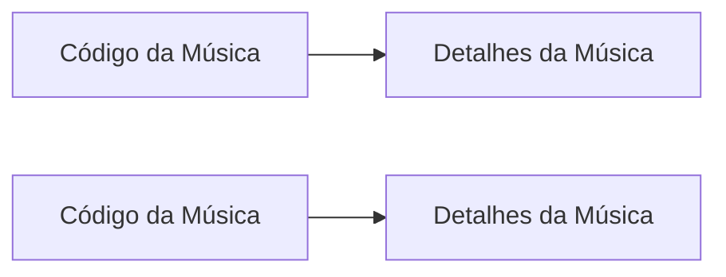
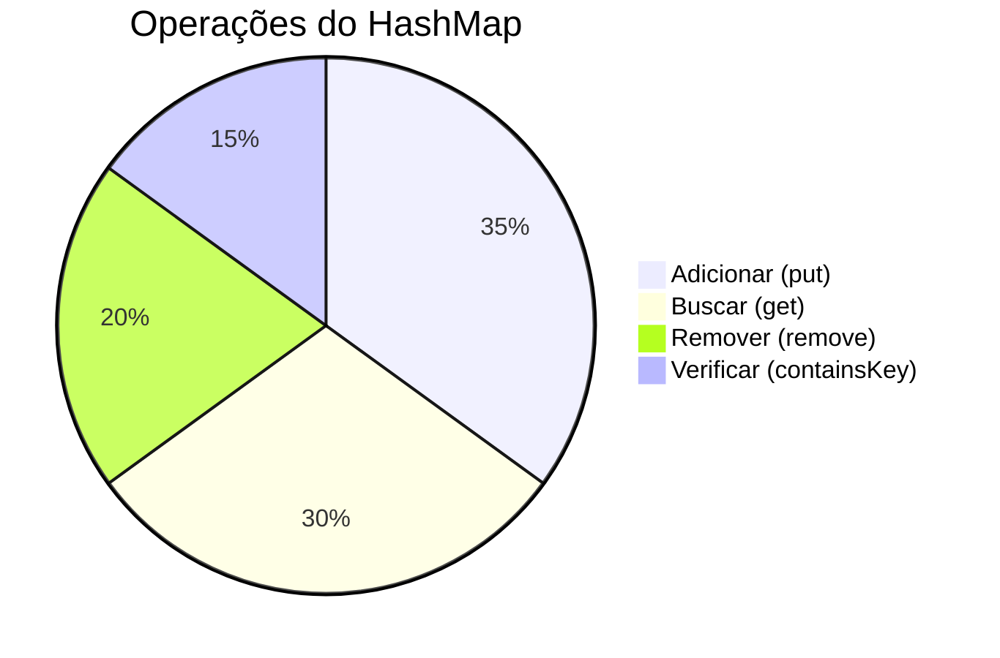

# HashMap


Entenda como o HashMap funciona através de uma analogia com um serviço de streaming musical - onde cada música é encontrada instantaneamente por seu código único!

## Conceito Principal


Um HashMap funciona como um **catálogo musical digital**:
- **Chaves Únicas**: Cada música tem um código exclusivo (ex: `TRACK_123`)
- **Busca Instantânea**: Encontre qualquer música em tempo constante ⚡
- **Armazenamento Dinâmico**: Expande automaticamente conforme novas músicas são adicionadas

Exemplo de Código: "[MusicStreamingService](/DataStructure/HashMap/MusicStreamingService.java)"

Saída Esperada:
```text
Catálogo Completo: {TRACK_001=Bohemian Rhapsody - Queen, TRACK_002=Imagine - John Lennon, TRACK_003=Shape of You - Ed Sheeran}

Playlist:
Código: TRACK_001 | Música: Bohemian Rhapsody - Queen
Código: TRACK_002 | Música: Imagine - John Lennon
Código: TRACK_003 | Música: Shape of You - Ed Sheeran

Música TRACK_004 não está no catálogo

Catálogo após remoção: {TRACK_001=Bohemian Rhapsody - Queen, TRACK_003=Shape of You - Ed Sheeran}

Catálogo resetado: {}
```

## 🕹️ Funcionalidades Chave


| Operação      | Método          | Complexidade | Uso Prático            |
|---------------|-----------------|--------------|------------------------|
| Adicionar     | `put()`         | O(1)         | Nova música no sistema |
| Buscar        | `get()`         | O(1)         | Busca por código       |
| Remover       | `remove()`      | O(1)         | Remover música antiga  |
| Verificação   | `containsKey()` | O(1)         | Checar disponibilidade |

## 💡 Quando Usar HashMap?
- **Busca rápida**: Acesso direto a valores via chave única
- **Dados dinâmicos**: Coleções que mudam frequentemente
- **Organização flexível**: Quando ordem não é prioritária
- **Valores duplicados**: Múltiplas chaves podem ter valores iguais

## 🚨 Boas Práticas
1. Use tipos imutáveis para chaves
2. Sempre verifique existência com `containsKey` antes de `get`
3. Monitore o fator de carga para grandes datasets
4. Considere `LinkedHashMap` se precisar de ordem de inserção
