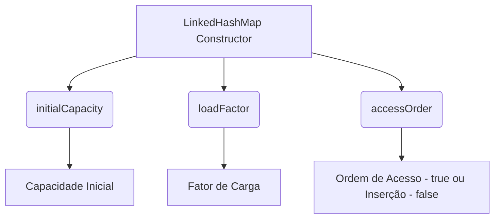

# LinkedHashMap - Gerenciamento Ordenado de Dados


Descubra como o **LinkedHashMap** pode ser utilizado para gerenciar dados mantendo a ordem de acesso ou de inserção – algo essencial em sistemas que requerem previsibilidade e performance. Diferente do HashMap tradicional, o LinkedHashMap permite que você defina a ordem dos elementos, garantindo que as entradas mais recentemente acessadas possam ser reposicionadas. 🔄

---

## Conceito Principal

O **LinkedHashMap** é uma implementação do Map que mantém uma lista duplamente encadeada dos elementos, permitindo definir se a ordem de iteração deve ser baseada na ordem de inserção ou na ordem de acesso (quando `accessOrder` é definido como `true`). Essa característica é particularmente útil quando você precisa, por exemplo, implementar caches ou sistemas de registro onde a ordem dos acessos é relevante.

---

## Funcionalidades Chave

- **Manutenção da Ordem**: Pode preservar a ordem de inserção ou a ordem de acesso, conforme definido no construtor.
- **Performance Consistente**: Operações básicas como `put`, `get` e `remove` permanecem com complexidade O(1) na maioria dos casos.
- **Reordenamento Dinâmico**: Quando `accessOrder` está habilitado, cada acesso a um elemento (via `get` ou `put`) reposiciona a entrada, facilitando a implementação de políticas de LRU (Least Recently Used).

---

## Explicando o Construtor do LinkedHashMap ⚙️

O construtor do **LinkedHashMap** é fundamental para configurar seu comportamento. Ele possui a seguinte assinatura:

```java
LinkedHashMap(int initialCapacity, float loadFactor, boolean accessOrder)
```

### Parâmetros:
- **initialCapacity**: Define a capacidade inicial do mapa. 📈  
  Exemplo: Se você sabe que o mapa terá muitos elementos, pode definir um valor maior para evitar redimensionamentos frequentes.

- **loadFactor**: Determina o quão cheio o mapa pode ficar antes de ser redimensionado. 📊  
  Exemplo: Um load factor de `0.75f` significa que o mapa será redimensionado quando atingir 75% de sua capacidade.

- **accessOrder**: Se `true`, a ordem de iteração do mapa é baseada no último acesso (útil para caches LRU); se `false`, mantém a ordem de inserção. 🔄  
  Exemplo: Para implementar um cache LRU, defina este parâmetro como `true`.

### Diagrama de Parâmetros do Construtor



💡 **Dica:** Utilize `accessOrder = true` para que o mapa se comporte como um cache LRU, onde os elementos menos utilizados são os primeiros candidatos à remoção.

---

## Exemplo de Código

Um exemplo prático que simula um sistema de registro de alunos (o código está em inglês para padronização):

[StudentRegistry](/src/DataStructure/LinkedHashMap/StudentRegistry.java)

---

## Quando Usar o LinkedHashMap? 🚀

- **Manutenção de Ordem**: Ideal quando a ordem dos elementos (inserção ou acesso) é importante para a lógica do sistema.
- **Caches e LRU**: Útil para implementar caches onde os elementos menos acessados devem ser descartados.
- **Logs e Histórico**: Perfeito para armazenar registros onde a ordem cronológica dos acessos precisa ser preservada.

---

## Boas Práticas 💡

1. **Defina Claramente o Modo de Ordem**: Utilize `accessOrder = true` somente se a reordenação baseada no acesso for necessária.
2. **Prefira HashMap se a Ordem Não Importar**: Caso contrário, opte por um HashMap para melhor performance.
3. **Monitore o Uso de Memória**: Em aplicações de cache, mantenha o tamanho do mapa controlado para evitar consumo excessivo de memória.
