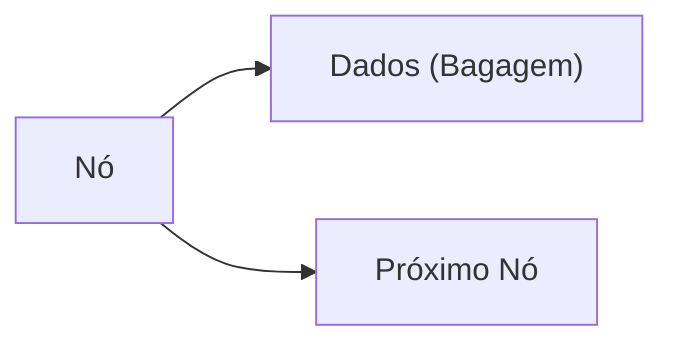
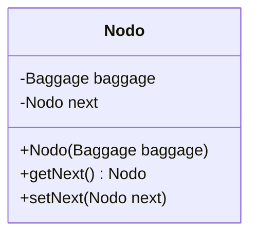
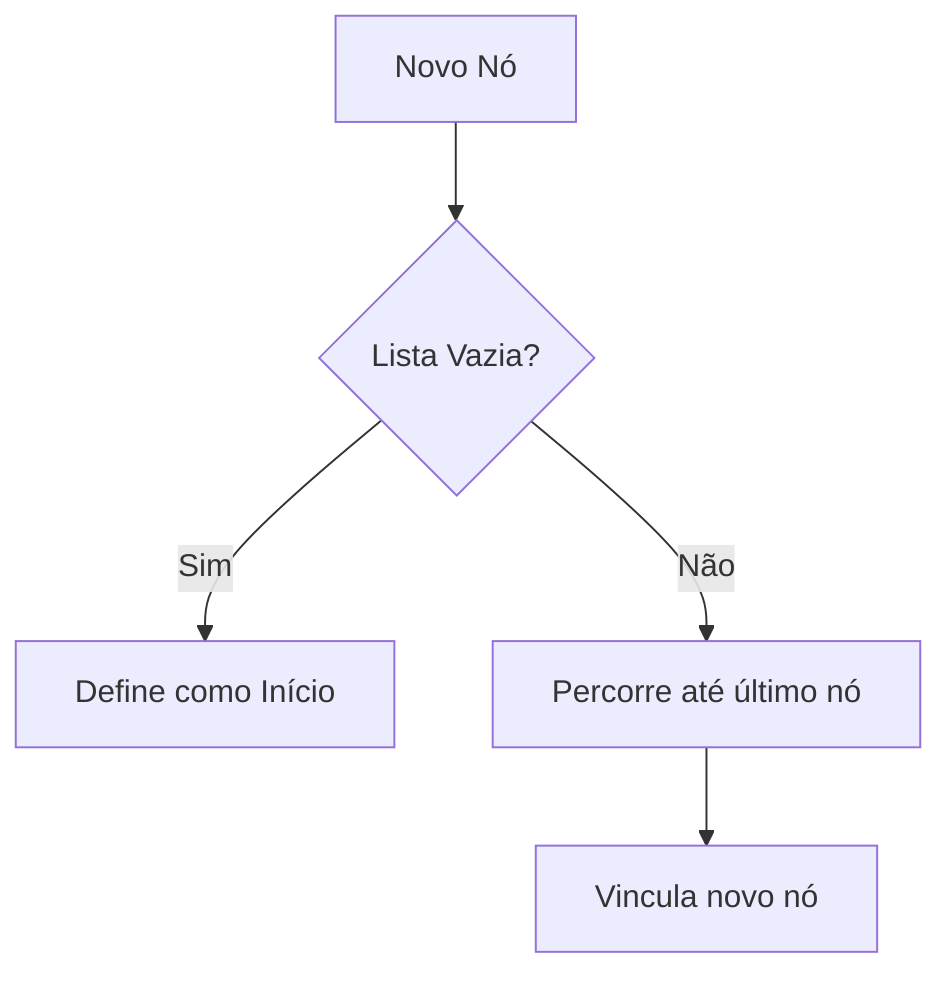

# 🛠️ Lista Simplesmente Ligada em Java


Implementação prática de uma lista encadeada para gerenciamento de bagagens de aeroporto.

## 📘 Conceito Fundamental



### 🔍 Características Essenciais
- **Estrutura Dinâmica**  
  ⚡ Cresce/reduz conforme necessidade  
  🚫 Sem tamanho fixo como arrays

- **Armazenamento Não Sequencial**  
  💾 Nós alocados em memória não contígua  
  🔗 Conexão via referências

- **Eficiência em Operações**  
  ⏱️ Inserções/remoções rápidas (O(1) no início)  
  ⚠️ Acesso sequencial necessário (O(n))

**Casos de Uso Ideais**:
- Sistemas com carga variável (ex: logística)
- Quando inserções/remoções são frequentes
- Filas de prioridade dinâmica

---

## 🗂️ Arquivos e Implementação

### 1. Estrutura de Classes
| Arquivo            | Descrição                                |
|--------------------|------------------------------------------|
| `Baggage.java`     | Modela uma bagagem com código e peso     |
| `Nodo.java`        | Unidade básica da lista (dado + próximo) |
| `LinkedList.java`  | Lógica completa da lista                 |
| `AirportTest.java` | Testes práticos da implementação         |

### 2. Métodos Principais
```java
public class LinkedList {
    private Nodo beginning;  // Primeiro nó
    
    // Verifica se lista está vazia
    public boolean isEmpty() { /*...*/ }
    
    // Adiciona nova bagagem no final
    public void addBaggage(Baggage baggage) { /*...*/ }
    
    // Calcula peso total
    public double totalWeight() { /*...*/ }
    
    // Exibe lista formatada
    public void printList() { /*...*/ }
}
```

---

## 🧪 Exemplo Prático Completo

### Cenário de Teste
```java
public class AirportTest {
    public static void main(String[] args) {
        LinkedList list = new LinkedList();
        
        // Adição de bagagens
        list.addBaggage(new Baggage("001", 10));
        list.addBaggage(new Baggage("002", 15));
        list.addBaggage(new Baggage("003", 25));
        list.addBaggage(new Baggage("004", 20));
        list.addBaggage(new Baggage("005", 30));

        // Operações
        System.out.println("Lista Completa:");
        list.printList();
        
        System.out.println("\nPeso Total: " + list.totalWeight());
    }
}
```

### Saída Detalhada
```text
Início da Lista
Posição: 0 → 005 (30kg) → 004 (20kg) → 003 (25kg) → 002 (15kg) → 001 (10kg) → null
Posição: 1 → 004 (20kg) → 003 (25kg) → 002 (15kg) → 001 (10kg) → null
Posição: 2 → 003 (25kg) → 002 (15kg) → 001 (10kg) → null
Posição: 3 → 002 (15kg) → 001 (10kg) → null
Posição: 4 → 001 (10kg) → null
Final da Lista

Peso total: 100kg
```

---

## ⚙️ Funcionamento Interno

### Estrutura de Nó


### Fluxo de Adição
1. Cria novo nó com a bagagem
2. Se lista vazia: define como início
3. Se não vazia: percorre até último nó
4. Define próximo do último nó como novo nó



---

## 📚 Aprendizados Chave
1. **Manipulação de Ponteiros**  
   Entenda como as referências `next` conectam os nós

2. **Complexidade Algorítmica**
    - Inserção no final: O(n)
    - Busca: O(n)
    - Remoção: O(n)

3. **Vantagens sobre Arrays**
    - Tamanho flexível
    - Inserções/remoções eficientes
    - Sem desperdício de memória

---