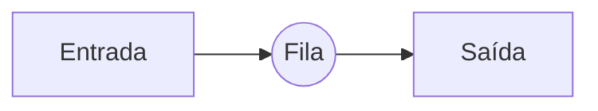
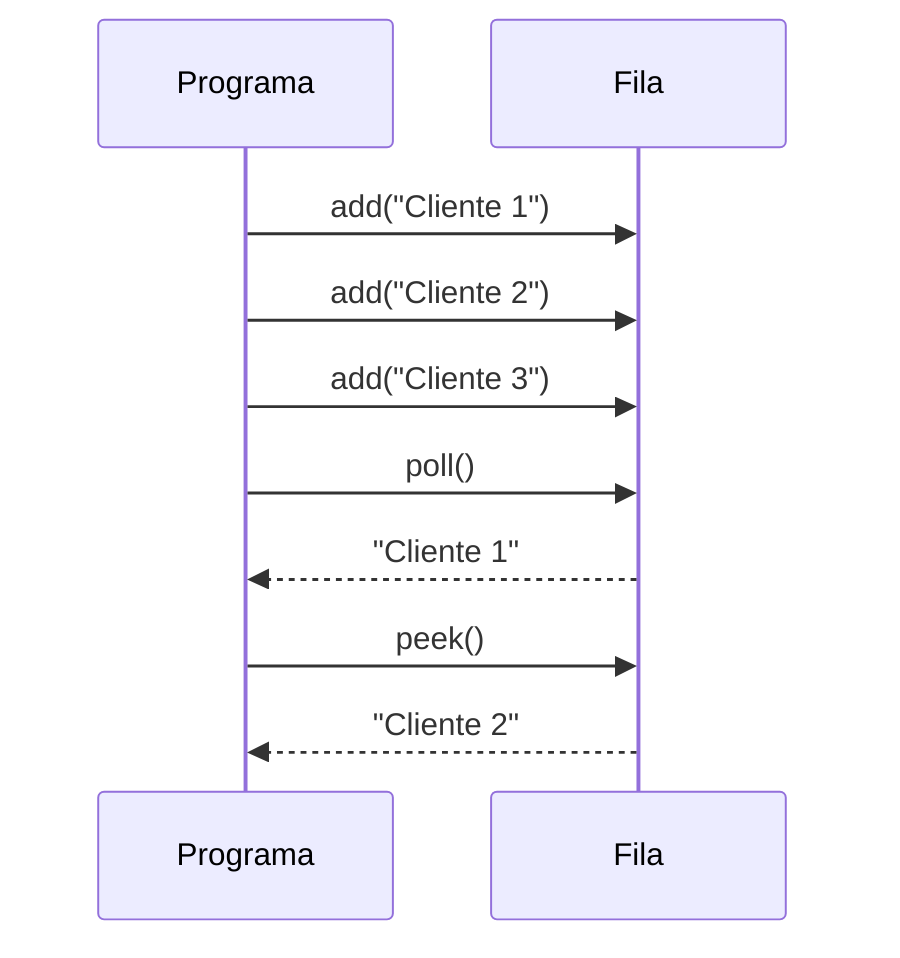
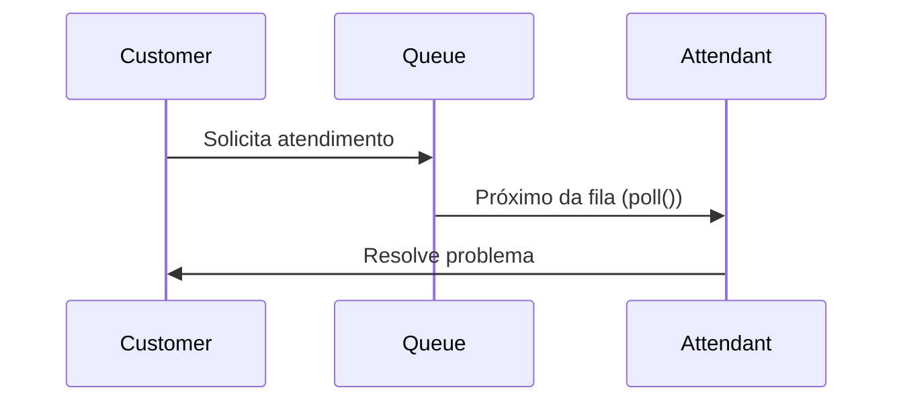
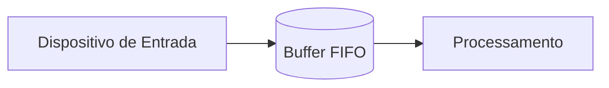
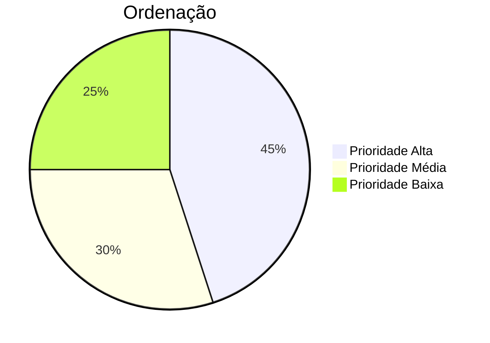
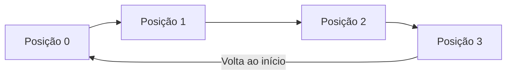
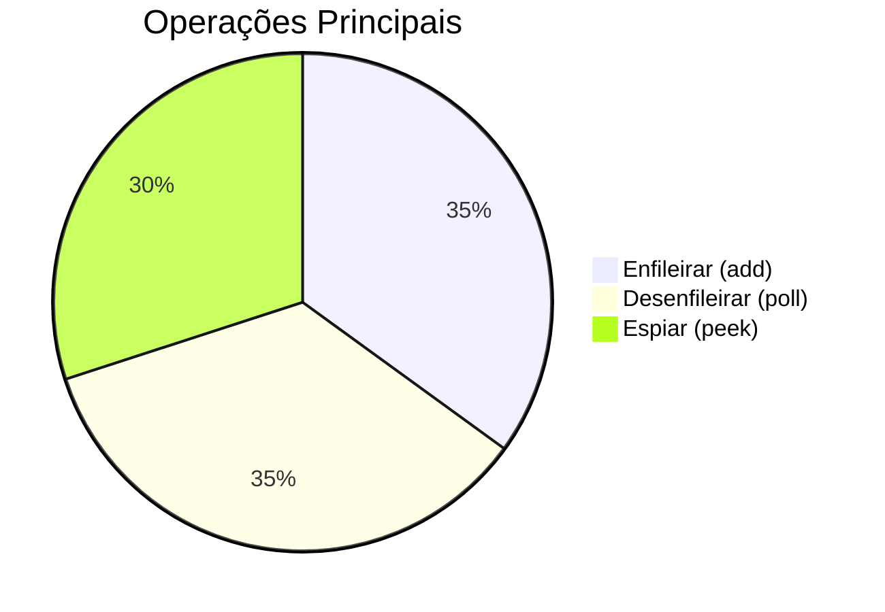

# 🚦 Exemplo de Fila (Queue) em Java


-green)

Implementação prática de uma fila usando `Queue` e `LinkedList` do Java Collections Framework.

## 📚 Conceito de Fila (Queue)



**Princípio FIFO** (First-In, First-Out):

- Primeiro elemento a entrar é o primeiro a sair
- Similar a filas da vida real (banco, supermercado)

## 🧩 Operações Principais

| Operação      | Método               | Complexidade | Descrição                    |
|---------------|----------------------|--------------|------------------------------|
| Enfileirar    | `add()`/`offer()`    | O(1)         | Adiciona elemento no final   |
| Desenfileirar | `poll()`/`remove()`  | O(1)         | Remove elemento do início    |
| Espiar        | `peek()`/`element()` | O(1)         | Visualiza elemento do início |

## 💻 Código Exemplo

### Estrutura Básica

```java
Queue<String> fila = new LinkedList<>();

// Adicionando elementos
fila.

add("Cliente 1");
fila.

add("Cliente 2"); 
fila.

add("Cliente 3");

// Removendo elemento
String atendido = fila.poll();

// Visualizando primeiro elemento
String proximo = fila.peek();
```

### Execução Passo a Passo



## 📊 Saída Esperada

```text
👥 Clientes na fila: [Customer 1, Customer 2, Customer 3]
✅ Cliente atendido: Customer 1
👥 Clientes restantes: [Customer 2, Customer 3]
👀 Próximo da fila: Customer 2
👥 Clientes na fila após peek(): [Customer 2, Customer 3]
```

## 🚀 **Quando Usar Filas?** - Casos Reais Explicados

### 1. Sistemas de Atendimento ao Cliente

**Funcionamento**:



- **Exemplo Prático**:
  ```java
  Queue<String> customers = new LinkedList<>();
  customers.add("Customer Premium");
  customers.add("Customer Regular");
  // Attendance: customers.poll() → "Customer Premium"
  ```

### 2. Gerenciamento de Tarefas em Impressão

**Mecanismo**:

- Cada documento entra na fila
- Impressora processa em ordem FIFO
- Prioridades especiais usam `PriorityQueue`

**Código**:

```java
Queue<Document> Impression = new LinkedList<>();
Impression.add(new Document("Report.pdf"));
Impression.add(new Document("Contract.docx"));
Impression.poll().print(); // Print first report
```

### 3. Buffers de Dados em Streaming

**Funcionamento**:



- **Cenário Real**: Player de vídeo armazenando os próximos 5 segundos em buffer
- **Vantagem**: Evita interrupções no fluxo contínuo

### 4. Algoritmos BFS (Busca em Largura)

**Implementação**:

```java
Queue<No> queue = new LinkedList<>();
queue.add(root);

while(!queue.isEmpty()) {
    Node current = queue.poll();
    queue.addAll(current.getNeighbors());
}
```

**Uso Típico**:

- Encontrar caminho mais curto em mapas

---

## 📚 **Extensões Sugeridas** - Tipos Especiais de Filas

### 1. ArrayQueue (Fila com Array Fixo)

| Característica    | Detalhe                                    |
|-------------------|--------------------------------------------|
| **Implementação** | Uso de array circular                      |
| **Vantagem**      | Melhor performance de memória              |
| **Desvantagem**   | Tamanho fixo                               |
| **Uso Ideal**     | Sistemas embarcados com recursos limitados |

**Exemplo**:

```java
ArrayQueue<String> fila = new ArrayQueue<>(5);
fila.

enqueue("A");
fila.

enqueue("B");
```

### 2. PriorityQueue (Fila Prioritária)



- **Funcionamento**:
  ```java
  Queue<Paciente> emergencia = new PriorityQueue<>(Comparator.comparingInt(Paciente::getGravidade));
  emergencia.add(new Paciente("COVID", 2));
  emergencia.add(new Paciente("FRATURA", 3));
  emergencia.poll(); // Atende COVID primeiro (prioridade maior)
  ```

### 3. BlockingQueue (Fila Thread-Safe)

| Cenário    | Comportamento                              |
|------------|--------------------------------------------|
| Fila cheia | Bloqueia até ter espaço                    |
| Fila vazia | Bloqueia até ter elementos                 |
| **Uso**    | Sistemas concorrentes (ex: servidores web) |

**Exemplo Produtor-Consumidor**:

```java
BlockingQueue<Tarefa> tarefas = new LinkedBlockingQueue<>(10);

// Produtor
new Thread(() -> {
    tarefas.put(new Tarefa());
}).start();

// Consumidor 
new Thread(() -> {
    Tarefa t = tarefas.take();
}).start();
```

### 4. CircularBuffer (Fila Circular)

**Mecanismo**:



- **Vantagem**: Reutiliza espaços automaticamente
- **Aplicação**: Sistemas de telemetria em tempo real
- **Exemplo**:
  ```java
  CircularBuffer<Double> sensorData = new CircularBuffer<>(100);
  sensorData.add(23.5);
  sensorData.add(24.1); 
  // Quando cheio, sobrescreve o dado mais antigo
  ```

---

## 🔍 **Comparação Entre Tipos de Filas**

| Tipo             | Ordenação  | Tamanho  | Thread-Safe | Uso Típico                     |
|------------------|------------|----------|-------------|--------------------------------|
| LinkedList Queue | FIFO       | Dinâmico | Não         | Casos gerais                   |
| ArrayQueue       | FIFO       | Fixo     | Não         | Sistemas com memória limitada  |
| PriorityQueue    | Prioridade | Dinâmico | Não         | Hospitais, sistemas de tickets |
| BlockingQueue    | FIFO       | Dinâmico | Sim         | Aplicações concorrentes        |
| CircularBuffer   | FIFO       | Fixo     | Opcional    | Coleta contínua de dados       |

---

Esta explicação detalhada ajuda a entender quando e como usar cada tipo de fila, além de proporcionar uma visão clara
das diferentes implementações disponíveis no ecossistema Java. 😊

## ⚠️ Melhores Práticas

- Prefira `offer()` em vez de `add()` para evitar exceções
- Use `poll()` em vez de `remove()` para retorno null seguro
- Verifique sempre `isEmpty()` antes de operações de remoção

## 🔍 Comparação com Pilha (Stack)

