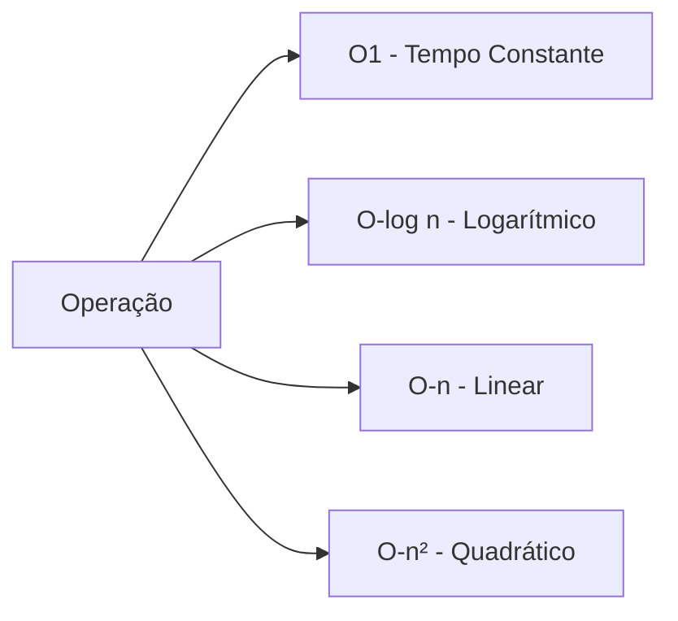
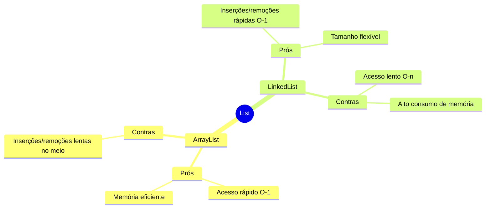
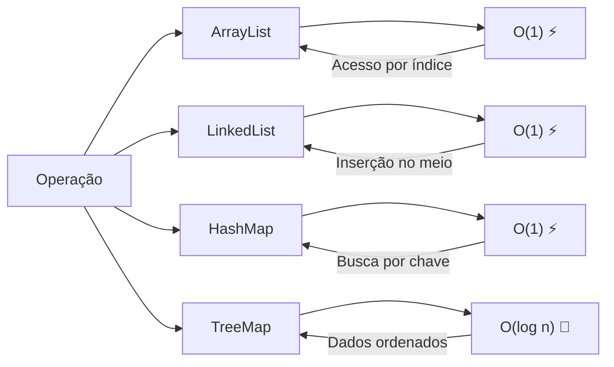
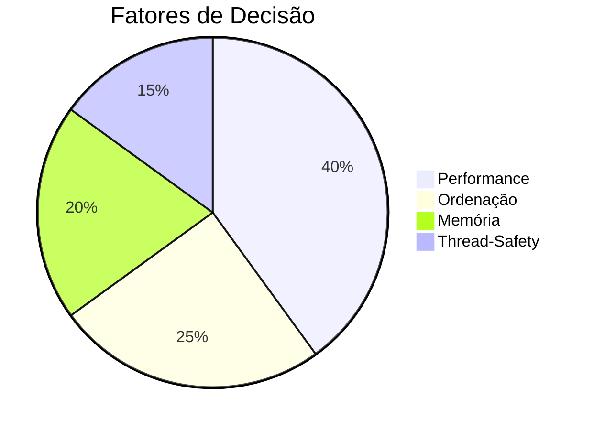

# 🗃️ Estruturas de Dados em Java

## 📌 Introdução

As Collections são **ferramentas fundamentais** para manipulação eficiente de dados em Java. Escolher a estrutura certa
pode significar a diferença entre um sistema ultrarrápido 🚀 e uma aplicação lenta 🐢!

- [LinkedList](/src/DataStructure/LinkedSimpleList/README.md): Conceitos sobre lista encandeadas
- [Queue](/src/DataStructure/Queue/README.md): Conceitos sobre filas


---

## 🎓 Conceitos Chave

### 🔢 Complexidade Assintótica (Big O)

A linguagem universal para medir eficiência de algoritmos:



- **O(1)** ⚡: Tempo de execução constante, independente dos dados  
  *Exemplo: Acesso por índice em ArrayList*

- **O(log n)** 🌲: Tempo cresce lentamente mesmo com dados aumentando  
  *Exemplo: Busca em TreeSet*

- **O(n)** 📈: Tempo proporcional ao tamanho dos dados  
  *Exemplo: Busca sequencial em LinkedList*

- **O(n²)** 💥: Tempo cresce exponencialmente - evitar!  
  *Exemplo: Algoritmos com loops aninhados*

---

## 🧩 Principais Collections

### 1. 🎯 Set (Elementos Únicos)

**Funciona como um conjunto matemático** - ideal para quando a unicidade é crucial!

#### 🔍 Comparação Detalhada

| Característica         | `HashSet`     | `LinkedHashSet`   | `TreeSet`         |
|------------------------|---------------|-------------------|-------------------|
| **Ordenação**          | Aleatória     | Ordem de inserção | Ordenação natural |
| **Complexidade Busca** | O(1) ⚡        | O(1) ⚡            | O(log n) 🌲       |
| **Memória**            | Baixo consumo | Moderado          | Alto              |
| **Nulls**              | Permitidos    | Permitidos        | Proibidos         |

**Quando usar?**:

- Remover duplicatas de uma lista ➡️ `HashSet`
- Manter ordem de inserção ➡️ `LinkedHashSet`
- Dados ordenáveis (números, datas) ➡️ `TreeSet`

---

### 2. 📜 List (Sequência Ordenada)

**Preserva a ordem de inserção** - como uma prateleira de livros onde a posição importa! 📚

#### ⚖️ ArrayList vs LinkedList



**Exemplo Prático**:

```java
// Para leitura intensiva:
List<String> logMessages = new ArrayList<>();

// Para modificações frequentes:
List<SensorData> sensorStream = new LinkedList<>();
```

---

### 3. 🗺️ Map (Dicionário Chave-Valor)

**Funciona como um dicionário** - cada palavra (chave) tem seu significado (valor) único! 📖

#### 🔑 HashMap vs TreeMap

| Operação              | `HashMap`           | `TreeMap`               |
|-----------------------|---------------------|-------------------------|
| **Estrutura Interna** | Tabela Hash         | Árvore Rubro-Negra      |
| **Ordenação**         | Não ordenado        | Ordem natural           |
| **Complexidade**      | O(1) para operações | O(log n) para operações |
| **Uso de Memória**    | Moderado            | Alto                    |

**Caso Real**:

```java
// Cache simples:
Map<String, Product> productCache = new HashMap<>();

// Catálogo ordenado:
Map<Integer, Student> studentsById = new TreeMap<>();
```

---

## 🏆 Comparação de Performance

| Operação     | ArrayList | LinkedList | HashMap | TreeMap  |
|--------------|-----------|------------|---------|----------|
| **Inserção** | O(1)*     | O(1)       | O(1)*   | O(log n) |
| **Busca**    | O(1)      | O(n)       | O(1)*   | O(log n) |
| **Remoção**  | O(n)      | O(1)       | O(1)*   | O(log n) |

> *Valores assumindo boa distribuição de hash e sem colisões



---

## 💡 Dicas para Entrevistas Técnicas

### ❓ "Quando usar ArrayList vs LinkedList?"

**Resposta Estruturada**:

1. Analise o caso de uso:
    - **Acesso aleatório frequente** → ArrayList (O(1))
    - **Inserções/remoções no meio** → LinkedList (O(1))
2. Considere memória:
    - ArrayList usa array contíguo (eficiente)
    - LinkedList usa nós dispersos (mais memória)
3. Mencione exemplos:
    - ArrayList: Catálogo de produtos em e-commerce
    - LinkedList: Player de música com next/previous

### ❓ "O que é fail-fast em Collections?"

**Explicação Técnica**:
> "Fail-fast é um comportamento onde uma collection lança `ConcurrentModificationException` se for modificada durante
> iteração. É comum em ArrayList e HashMap. Para evitar, use `ConcurrentHashMap` ou itere via `Iterator.remove()`" 🛡️

---

## 🚀 Conclusão

Dominar collections requer entender:

1. **Natureza dos dados** (únicos, ordenados, pares)
2. **Operações principais** (leitura vs escrita)
3. **Trade-offs** (velocidade vs memória)


